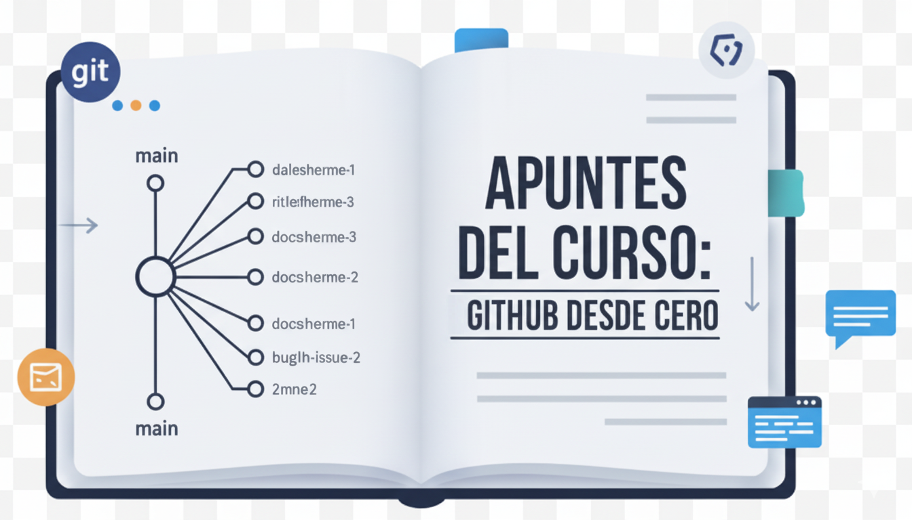

# 📚 Curso: GitHub y Git Desde Cero

> **Objetivo:** Adquirir una comprensión profunda y práctica del sistema de control de versiones Git y de la plataforma de colaboración GitHub.

---

## 🧭 Módulo I: Fundamentos y Configuración (Lecciones 1-6)

Este módulo establece la base teórica y la configuración inicial de Git en el entorno local.

| Lección          | Título               | Conceptos Clave                                                               | Comandos / Notas                                                               |
| :--------------- | :------------------- | :---------------------------------------------------------------------------- | :----------------------------------------------------------------------------- |
| **Introducción** | Introducción         | Propósito del curso y control de versiones.                                   |                                                                                |
| **L1**           | Introducción a Git   | Definición de Git (DVCS), diferencia con otras herramientas.                  | Comienza la parte de Git.                                                      |
| **L2**           | Historia de Git      | Contexto histórico y creación de Git por Linus Torvalds.                      |                                                                                |
| **L3**           | Instalación de Git   | Proceso de instalación en diferentes sistemas operativos (Mac/Linux/Windows). | Verificar instalación: `git --version`.                                        |
| **L4**           | Comandos Terminal    | Navegación básica (`cd`, `ls`, `mkdir`), fundamentos de la línea de comandos. | Prerrequisito esencial.                                                        |
| **L5**           | Configuración de Git | Establecer la identidad del usuario para los _commits_.                       | `git config --global user.name "..."`, `git config --global user.email "..."`. |
| **L6**           | `git init`           | Inicializar un repositorio local.                                             | `git init` (Crea la carpeta `.git`).                                           |

---

## 🌳 Módulo II: Flujo de Trabajo Local y Versiones (Lecciones 7-22)

Enfoque en cómo rastrear, guardar, revertir y organizar el historial de versiones en tu máquina.

| Lección | Título                            | Conceptos Clave                                                                        | Comandos / Notas                             |
| :------ | :-------------------------------- | :------------------------------------------------------------------------------------- | :------------------------------------------- |
| **L7**  | Ramas en Git                      | Introducción al concepto de _branches_ (líneas de desarrollo paralelas).               |                                              |
| **L8**  | `git add` y `git commit`          | Proceso de _Staging Area_ y creación de puntos de guardado.                            | `git add .`, `git commit -m "Mensaje"`.      |
| **L9**  | `git log` y `git status`          | Herramientas para visualizar el historial y el estado de los archivos.                 | `git log`, `git status`.                     |
| **L10** | `git checkout` y `git reset`      | Moverse entre _commits_ y manipular el historial.                                      | `git checkout [hash]`, `git reset [hash]`.   |
| **L11** | `git alias`                       | Crear atajos personalizados para comandos largos de Git.                               | Aumenta la productividad.                    |
| **L12** | Fichero `.gitignore`              | Ignorar archivos innecesarios para Git (ej. dependencias, logs).                       |                                              |
| **L13** | `git diff`                        | Comparar las diferencias entre el _Working Directory_ y el _Staging Area_ o _Commits_. |                                              |
| **L14** | Desplazamiento                    | Moverse entre _commits_ y estados específicos de una rama.                             | Referencias (`HEAD`, `~`, `^`).              |
| **L15** | `git reset --hard` y `git reflog` | Recuperar trabajo perdido o revertir cambios de forma destructiva.                     | **PELIGROSO:** Usar `reflog` para recuperar. |
| **L16** | `git tag`                         | Marcar puntos importantes en el historial (ej. versiones de lanzamiento).              | `git tag v1.0`.                              |
| **L17** | `git branch` y `git switch`       | Gestionar ramas y cambiar entre ellas de forma moderna (`switch`).                     | `git branch -a`, `git switch [rama]`.        |
| **L18** | `git merge`                       | Combinar los cambios de una rama a otra.                                               |                                              |
| **L19** | Resolución de conflictos          | Cómo solucionar _merge conflicts_ cuando Git no puede fusionar automáticamente.        |                                              |
| **L20** | `git stash`                       | Guardar cambios temporalmente sin hacer _commit_.                                      | `git stash save "mensaje"`.                  |
| **L21** | Reintegración de ramas            | Prácticas para mantener las ramas actualizadas antes de fusionar.                      |                                              |
| **L22** | Eliminación de ramas              | Borrar ramas locales y remotas después de la fusión.                                   | `git branch -d`, `git push origin --delete`. |

---

## 🔗 Módulo III: GitHub y Colaboración Remota (Lecciones 23-39)

Transición de lo local a la nube y el trabajo colaborativo.

| Lección | Título                          | Conceptos Clave                                                          | Comandos / Notas                          |
| :------ | :------------------------------ | :----------------------------------------------------------------------- | :---------------------------------------- |
| **L23** | Introducción a GitHub           | Plataforma, _Issues_, _Pull Requests_.                                   | Comienza la parte de GitHub.              |
| **L24** | Primeros pasos                  | Navegación, _feed_, perfil.                                              |                                           |
| **L25** | Repositorio personal            | Gestión de tu propia carpeta de proyectos.                               |                                           |
| **L26** | Local y Remoto                  | La relación entre tu máquina y GitHub.                                   | **Local** vs **origin**.                  |
| **L27** | Autenticación SSH               | Configurar claves para una conexión segura y sin contraseñas.            |                                           |
| **L28** | Repositorio proyecto            | Configuración de visibilidad (_public/private_) y descripción.           |                                           |
| **L29** | `git remote`                    | Gestionar las conexiones con repositorios remotos.                       | `git remote add origin`, `git remote -v`. |
| **L30** | Subida de un proyecto           | Proceso de conectar un repo local vacío a GitHub.                        |                                           |
| **L31** | `git fetch` y `git pull`        | Diferencia entre solo descargar (`fetch`) e integrar (`pull`).           |                                           |
| **L32** | `git clone`                     | Descargar un repo remoto a tu máquina.                                   | `git clone [URL]`.                        |
| **L33** | `git push`                      | Enviar commits locales al repositorio remoto.                            | `git push origin [rama]`.                 |
| **L34** | Fork en GitHub                  | Crear una copia personal de un repositorio de otro usuario.              |                                           |
| **L35** | Flujo colaborativo              | Cómo trabajar con _Forks_ y _Pull Requests_.                             |                                           |
| **L36** | Pull Request (PR)               | Solicitud formal de fusión de código. Mecanismo central de colaboración. |                                           |
| **L37** | Ejercicio práctico              | Aplicación de los comandos y flujos aprendidos.                          |                                           |
| **L38** | Resolución de conflictos en PRs | Abordar conflictos antes de la fusión en GitHub.                         |                                           |
| **L39** | Sincronización de un Fork       | Mantener tu _Fork_ actualizado con el repositorio original (_upstream_). |                                           |

---

## ✨ Módulo IV: Herramientas Avanzadas y Flujos de Trabajo (Lecciones 40-45)

Profundización en la documentación, la automatización y técnicas avanzadas de Git.

| Lección | Título                           | Conceptos Clave                                                                                                    | Comandos / Notas |
| :------ | :------------------------------- | :----------------------------------------------------------------------------------------------------------------- | :--------------- |
| **L40** | Markdown en GitHub               | Sintaxis para dar formato a la documentación (`README.md`, _Issues_).                                              |                  |
| **L41** | Herramientas gráficas (GUI)      | Uso de clientes de escritorio como alternativa a la Terminal.                                                      |                  |
| **L42** | Git y GitHub "flow"              | Modelos de trabajo estructurados (ej. _GitHub Flow_, _Git Flow_).                                                  |                  |
| **L43** | Ejemplo Gitflow                  | Implementación práctica del flujo Gitflow (ramas `develop`, `feature`, `release`).                                 |                  |
| **L44** | `git cherry-pick` y `git rebase` | **Avanzado:** Aplicar commits específicos de una rama a otra (`cherry-pick`). Reorganizar el historial (`rebase`). |                  |
| **L45** | GitHub Pages y Actions           | Alojamiento web simple (Pages) y automatización de tareas (Actions).                                               |                  |

---

## 🎯 Ejercicio Final del Curso

Para practicar el flujo completo de colaboración visto hasta la **Lección 36**:

1.  **Fork** del repositorio original.
2.  **Clone** tu Fork a tu máquina local.
3.  Crea una **nueva rama** (`mi_nombre_usuario`).
4.  Añade tu nombre de usuario al documento `hello.md` (o el equivalente en el curso).
5.  **Commit** y **Push** tu rama a tu Fork.
6.  Crea un **Pull Request** desde tu Fork hacia el repositorio original.

---

**Próximo Paso:** Una vez que confirmes que este contenido es el que deseas, sigue los pasos de **Merge** y **Push** a la rama `main` que te indiqué anteriormente.
